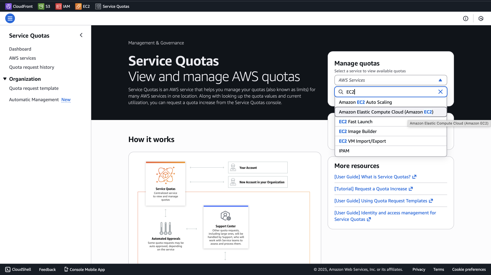
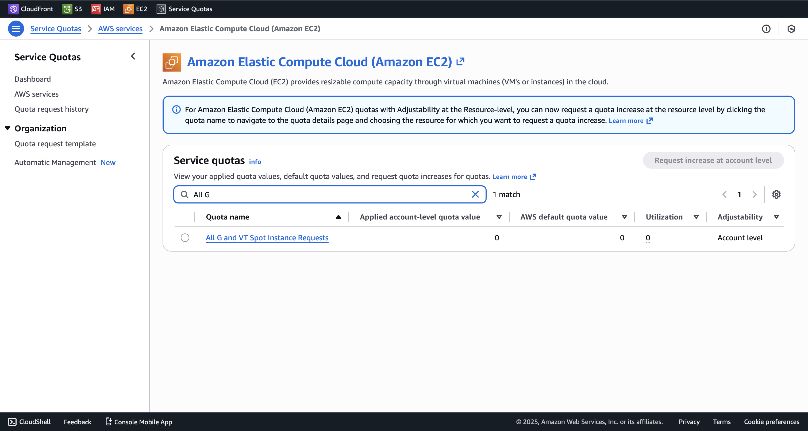
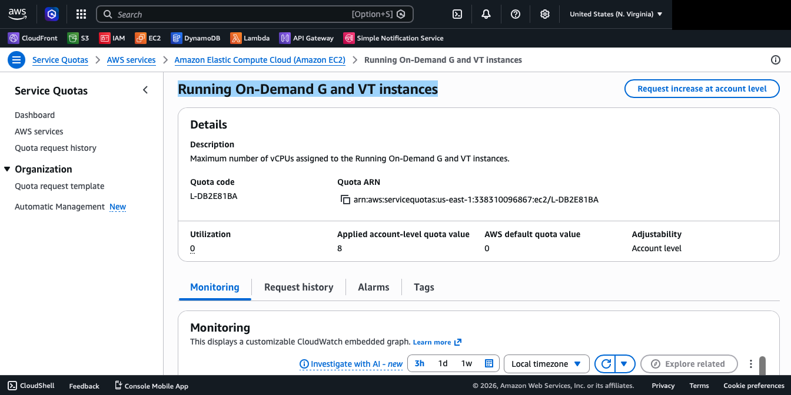
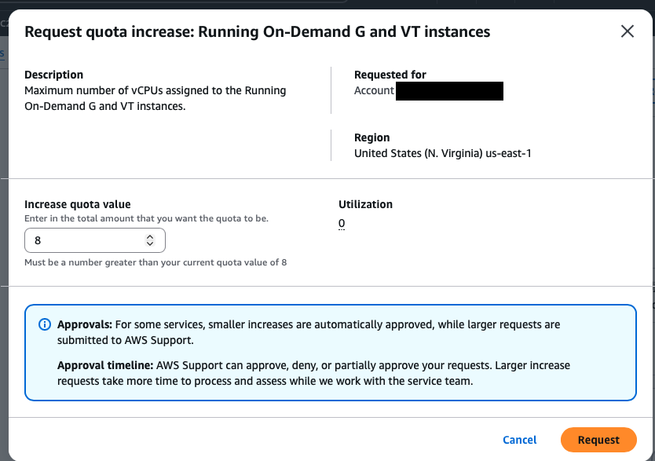

# Deployment
## Prerequisites
You need to download the following cli tools to do everything here
- [AWS CLI](https://aws.amazon.com/cli/)
- [Terraform](https://www.terraform.io/downloads)


## AWS Setup
First, make sure AWS Cli is downloaded. Then, configure your AWS CLI with your credentials.
```bash
aws configure
```
You will be prompted to enter your AWS Access Key ID, AWS Secret Access Key, Default region name, and Default output format. Just enter the appropriate values for your account.
Of course, make sure that your AWS user has the appropriate permissions to create EC2 instances, IAM roles, etc. I recommend assigning the `PowerUserAccess` policy to your user for simplicity.

## Requesting Service Quota
In order to use any `g6e` instances, we have to request the appropriate amount of vCPU units from AWS:

### Step 1
Open the AWS Console and go to `Service Quotas`.


### Step 2
Search and Click `Running On-Demand G and VT instances`.


### Step 3
Click on `Request increase at account level` at the top right


### Step 4
Click on `Request quota increase` and request the appropriate 8 vCPU units.


### AWS CLI
You can also request the quota increase using AWS CLI:
```bash
aws service-quotas request-service-quota-increase \
    --service-code ec2 \
    --quota-code L-DB2E81BA \
    --desired-value 8
```


## Creating Key Pairs
Before provisioning resources, we must create key pairs so that we can ssh into the remote machine.
```bash
aws ec2 create-key-pair --key-name spleeter-training --query 'KeyMaterial' --output text > spleeter-training.pem
```
Make sure to save the key file somewhere secure and set the appropriate permissions:
```bash
chmod 400 spleeter-training.pem
```

## Terraform Initialization
Next, inialize Terraform in the deployment directory:
```bash
terraform init
```

## Provisioning Resources to Cloud
Now that everything has been setup, we can now provision resources to the cloud using Terraform.
```bash
terraform apply
```

## Connecting to the Machine
Once the resources have been provisioned, you can ssh into the remote machine using the public IP address outputted by Terraform.
```bash
ssh -i "spleeter-training.pem" ubuntu@<PUBLIC_IP>
```

## Terminating Resources
If you are done with training your model and have downloaded the model to you local machine, you can terminate the resources you provisioned by:
```bash
terraform destroy
```
